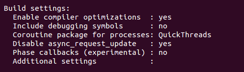
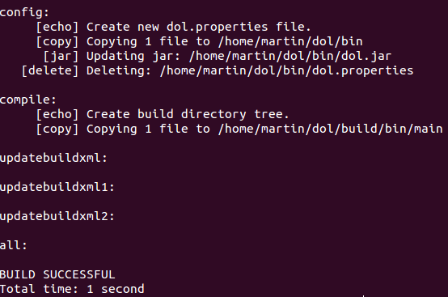
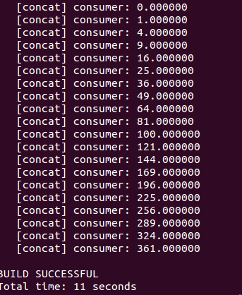

#Embeddedness Designing Experiment
##DOL
###What is DOL ?
>The distributed operation layer (DOL) is a framework that enables the (semi-) automatic mapping of applications onto the multiprocessor SHAPES architecture platform. The DOL consists of basically three parts:

>* DOL Application Programming Interface: The DOL defines a set of computation and communication routines that enable the programming of distributed, parallel applications for the SHAPES platform. Using these routines, application programmers can write programs without having detailed knowledge about the underlying architecture. In fact, these routines are subject to further refinement in the hardware dependent software (HdS) layer.

>* DOL Functional Simulation: To provide programmers a possibility to test their applications, a functional simulation framework has been developed. Besides functional verification of applications, this framework is used to obtain performance parameters at the application level.

>* DOL Mapping Optimization: The goal of the DOL mapping optimization is to compute a set of optimal mappings of an application onto the SHAPES architecture platform. In a first step, XML based specification formats have been defined that allow to describe the application and the architecture at an abstract level. Still, all the information necessary to obtain accurate performance estimates is contained.

###The process of configuring DOL based on Ubuntu 14.04
* Create a new folder named dol and extract dolethz.zip to it ***unzip dol_ethz.zip -d dol***. When finished, extract systemc-2.3.1 ***tar -zxvf systemc-2.3.1.tgz***
* In the catalog of systemc-2.3.1, create a new folder objdir. In the catalog of objdir, configure g++ for compiling ***configure CXX=g++ --disable-async-updates***

* Compile systemc ***sudo make install (in the catalog of systemc-2.3.1)***
* Alter the file **build_zip.xml** in catalog dol: < property name="systemc.inc" value="home/martin/systemc-2.3.1/include/" >
< property name="systemc.lib" value="home/martin/systemc-2.3.1/lib-linux64/libsystemc.a">
* Compile dol ***ant -f build_zip.xml all***

* In the catalog of dol/build/bin/main, run the first example ***sudo ant -f runexample.xml -Dnumber=1***

#### The environment for DOL development has been successfully built !

###Experimental experience
    This experiment has me know the foundamental knowledge of DOL, including what is DOL and how to build a environment for DOL developing. Moreover, I also learn to use a github to reserve my experiment results and update my learining progress, maybe even share my experiences with the others in the near future. I also become to how what "markdown" is and begin to  type some words with this kind of language, like this article.Quite a beginning.

