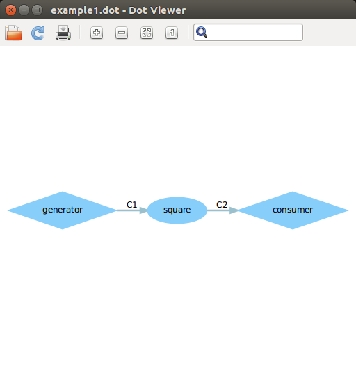
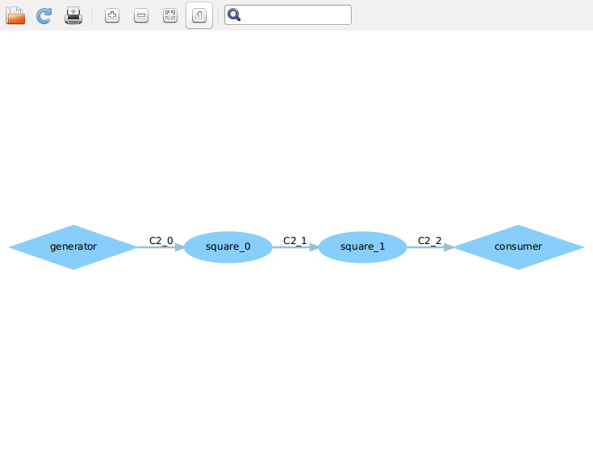
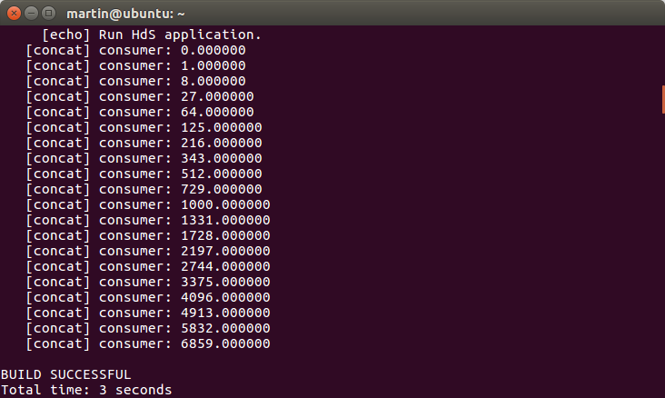
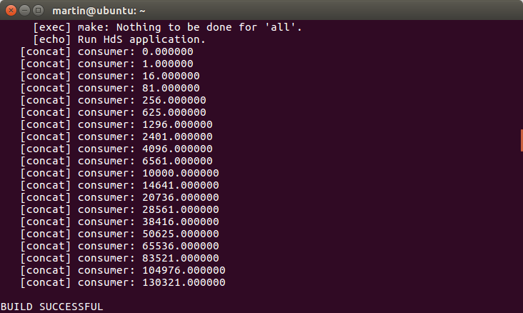

##Example1.dot

##Example2.dot

##The details of altering the code
###First problem
The problem asks us to reduce one square block, so we just need to reset the iteration times to 2.
The iteration times are set in the file that arranges the connection between the producer and the consumer. Just enter the file example2.xml and we will find that the line "variable value="3" name="N"" defines the iteration times. Change "value="3"" to "value="2"" and run the example to see if it works.

###Second problem
The problem asks us to alter the source code to make the square numbers become the output instead of the original cubical numbers.Simple as it is, we just need to find the code that mutiplies the original numbers and alter the times the multiplication proceeds. That is, change i=i\*i to i=i\*i\*i.

###Reflections on the experiment
The experiment file elaborates the implementation of the generator, the consumer and the connections between them, which helps me understand the conceptions of DOL instance.I find that the code in xml files is kind of strange, which means I need to spend more time to understand what it's up to. However, once I get the point, I find that the file is like an arrangement for the code to run according to a certain procedure.

